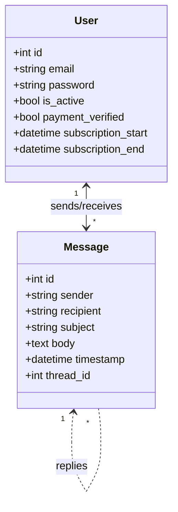
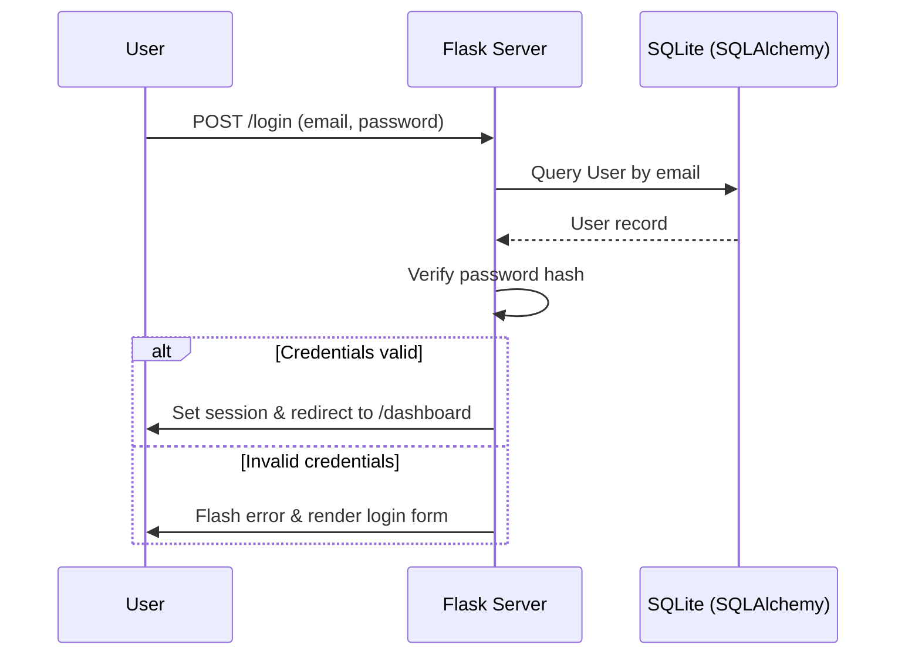

# SpeedMail

SpeedMail is a lightweight Flask application that simulates a subscription-based email service. It demonstrates user registration, admin approval, and simple messaging workflows while keeping the codebase intentionally compact for instructional and prototyping purposes.

## Features
- **User onboarding** – visitors can register with an `@speedmail.com` email address, log in, and manage their session.
- **Subscription gating** – inactive accounts are prompted to complete a payment step before gaining full access.
- **Admin approval** – administrators can review pending accounts and activate subscriptions.
- **Messaging scaffold** – SQLAlchemy models outline threaded messaging between users, ready for extension.

## Project structure
```
.
├── app.py              # Flask application, routes, and SQLAlchemy models
├── models.py           # Reusable SQLAlchemy models for external scripts/tests
├── static/             # Stylesheets
├── templates/          # Jinja templates for the UI
└── requirements.txt    # Python dependencies
```

## Architecture diagrams

### Domain classes


### Login flow


## Getting started

### Prerequisites
- Python 3.11+
- Virtual environment tool such as `venv` or `virtualenv`

### Installation
1. Clone the repository and enter the project directory.
2. Create and activate a virtual environment.
3. Install dependencies from `requirements.txt`.

```bash
python -m venv .venv
source .venv/bin/activate  # On Windows use `.venv\\Scripts\\activate`
pip install -r requirements.txt
```

### Running the app
1. Ensure the virtual environment is active.
2. Start the development server.

```bash
python app.py
```

The application creates an `instance/email.db` SQLite database automatically. Visit `http://localhost:5000` to interact with the UI.

## Extending the project
- Add new routes for composing, sending, and viewing threaded messages.
- Build a proper payment workflow by integrating with real payment APIs.
- Harden authentication by adding password reset, multi-factor prompts, and CSRF protection.
- Containerize the application or deploy to a PaaS for quick demos.

## License
This project is provided as-is for educational use. Add a license file if you plan to redistribute it.
